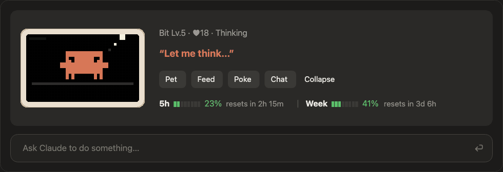

# Claude Code Pixel Pet

**English** | [简体中文](README.md)

An 8-bit pixel pet that lives above the Claude Code prompt. It acts out whatever Claude is doing, takes pets, snacks and pokes, chats with you through Haiku, and keeps an eye on your usage limits.



<sub>Mock-up with sample usage figures.</sub>

## Moods

<p>
  
  
  
  
</p>
<p>
  
  
  
  
</p>

## Features

- **Follows the work**: thinks when you send a message, types at a laptop while a command runs, reads a book while files are read, writes with a pencil while code is edited, holds a magnifier on the web, and calls a mini helper for subagents. It cries when a tool fails, waves and hops when a turn is done, and falls asleep after 10 quiet minutes.
- **Interaction**: pet it, feed it (it gets full), poke it (too many pokes and it gets grumpy), hover it for a heart. Level and affection persist across sessions.
- **Haiku chat**: press Chat to talk to it. After a longer turn it says one line about what just happened, at most once every 40 seconds.
- **Usage at a glance**: 5-hour and weekly limits as 8-cell pixel meters (green, yellow, red), time to reset, and the session's context tokens and cost.
- **English or Chinese**: the pet follows your system language (English unless it is Chinese). Switch any time with `/pet lang en`, `/pet lang zh` or `/pet lang auto`; the choice is remembered.
- **Commands**: `/pet` collapses or expands it, `/pet name <name>` renames it, `/pet stats` shows its stats, `/pet lang` sets its language.

The desktop app (Code tab) draws the full pixel pet; the terminal shows a kaomoji version.

## Install

Requires a recent Claude Code with plugin function hooks. That API is in early access and may change between releases; the pet was built on 2.1.287.

**One command** (macOS and Linux, needs `git` and either `python3` or `node`):

```bash
curl -fsSL https://raw.githubusercontent.com/zhizunbao-studio/claude-code-pixel-pet/main/install.sh | bash
```

It clones the plugin to `~/.claude/mods/pixel-pet`, backs up `~/.claude/settings.json`, and adds the two env entries below. Run it again to update. Then open a new Claude Code session, or restart the desktop app, to meet Bit.

To uninstall:

```bash
curl -fsSL https://raw.githubusercontent.com/zhizunbao-studio/claude-code-pixel-pet/main/install.sh | bash -s -- --uninstall
```

**By hand**: clone the repo to `~/.claude/mods/pixel-pet`, then add this at the top level of `~/.claude/settings.json`:

```json
"env": {
  "CLAUDE_CODE_PLUGIN_DIRS": "~/.claude/mods/pixel-pet",
  "CLAUDE_CODE_ENABLE_FUNCTION_HOOKS": "1"
}
```

To try it once without changing settings: `claude --plugin-dir ~/.claude/mods/pixel-pet`.

## Notes

- Chat and turn comments call Haiku through your own Claude Code session, so they count toward your plan's usage. Petting, feeding, poking and the canned lines run locally and use none.
- Nothing is sent anywhere else: the plugin reads no files, runs no commands and makes no network requests of its own.

## Development

```bash
claude plugin validate .
claude plugin test .
```

## Disclaimer

This is an unofficial fan project. It is not affiliated with or endorsed by Anthropic. The pixel character is based on the Claude Code mascot, whose likeness and trademarks belong to Anthropic; it will be removed if the rights holder asks.

The code is released under the MIT License (see [LICENSE](LICENSE)); the mascot likeness is not covered by it.
