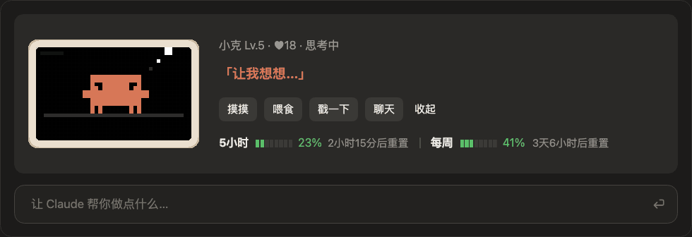

# Claude Code Pixel Pet 小克

[English](README.md) | **简体中文**

住在 Claude Code 输入框上方的 8-bit 像素电子宠物。它会跟着 Claude 正在做的事换动作，可以摸摸、喂食、戳一下，还能通过 Haiku 跟你聊天，顺便帮你盯着额度。



<sub>效果示意，图中的额度和花费是示例数据。</sub>

## 表情一览

<p>
  
  
  
  
</p>
<p>
  
  
  
  
</p>

## 功能

- **跟着任务变**：收到消息后思考，运行命令时敲电脑，读文件时翻书，改代码时拿笔写，上网时举放大镜，派子任务时叫出一个迷你分身；工具报错时哭，一轮完成时挥手蹦跳，10 分钟没动静会睡着。
- **互动**：摸摸、喂食（喂多了会撑）、戳一下（连续戳会生气）、鼠标悬停冒爱心。等级和亲密度会保存下来，换会话也不会丢。
- **Haiku 聊天**：点「聊天」直接跟它对话；一轮比较长的任务结束后，它会说一句感想（最多每 40 秒一次）。
- **额度一览**：显示 5 小时和每周额度（8 格像素进度条，按用量变绿、黄、红），重置倒计时，本次会话的上下文 token 数和花费。
- **中英双语**：自动跟随系统语言（中文系统显示中文，其他显示英文），也可以随时用 `/pet lang zh`、`/pet lang en`、`/pet lang auto` 切换，选择会记住。
- **命令**：`/pet` 收起或展开，`/pet name 新名字` 改名，`/pet stats` 查看数据，`/pet lang` 切换语言。

桌面版（Code 标签页）显示完整的像素画面；终端里显示颜文字版本。

## 安装

需要较新版本的 Claude Code，并且支持插件函数钩子（目前是早期预览接口，可能随版本变化，开发时用的是 2.1.287）。

**一键安装**（macOS 和 Linux，需要 `git`，以及 `python3` 或 `node` 其中之一）：

```bash
curl -fsSL https://raw.githubusercontent.com/zhizunbao-studio/claude-code-pixel-pet/main/install.sh | bash
```

脚本会把插件下载到 `~/.claude/mods/pixel-pet`，先备份 `~/.claude/settings.json`，再加上下面两项配置。再运行一次就是更新。装好后新开一个会话，或者重启桌面 App，小克就会出现。如果显示的是英文，运行 `/pet lang zh` 切到中文。

卸载：

```bash
curl -fsSL https://raw.githubusercontent.com/zhizunbao-studio/claude-code-pixel-pet/main/install.sh | bash -s -- --uninstall
```

**手动安装**：把仓库克隆到 `~/.claude/mods/pixel-pet`，然后在 `~/.claude/settings.json` 的最外层加上：

```json
"env": {
  "CLAUDE_CODE_PLUGIN_DIRS": "~/.claude/mods/pixel-pet",
  "CLAUDE_CODE_ENABLE_FUNCTION_HOOKS": "1"
}
```

只想试一次、不改配置的话，可以运行 `claude --plugin-dir ~/.claude/mods/pixel-pet`。

## 说明

- 聊天和任务点评通过你自己的 Claude Code 会话调用 Haiku，会计入你的订阅用量。摸摸、喂食、戳一下和平时的台词都在本地运行，不消耗额度。
- 不会把数据发到别处：插件本身不读文件、不执行命令，也不发起任何网络请求。

## 开发

```bash
claude plugin validate .
claude plugin test .
```

## 声明

这是一个非官方的粉丝作品，与 Anthropic 没有任何关联，也没有得到 Anthropic 的认可。小克的像素造型来自 Claude Code 的吉祥物，相关形象和商标归 Anthropic 所有；如果权利方提出要求，会立即移除。

代码部分以 MIT 协议开源（见 [LICENSE](LICENSE)），不包括上述吉祥物形象。
